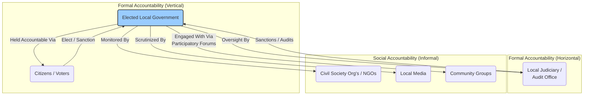

```mermaid
graph TD
    A(Elected Local Government)

    subgraph "Formal Accountability (Vertical)"
        B(Citizens / Voters)
        A -- "Held Accountable Via" --> B
        B -- "Elect / Sanction" --> A
    end

    subgraph "Formal Accountability (Horizontal)"
        C(Local Judiciary /<br>Audit Office)
        A -- "Oversight By" --> C
        C -- "Sanctions / Audits" --> A
    end

    subgraph "Social Accountability (Informal)"
        D(Civil Society Org's / NGOs)
        E(Local Media)
        F(Community Groups)
        A -- "Monitored By" --> D
        A -- "Scrutinized By" --> E
        A -- "Engaged With Via<br>Participatory Forums" --> F
    end

    style A fill:#9cf,stroke:#333,stroke-width:2px
```
