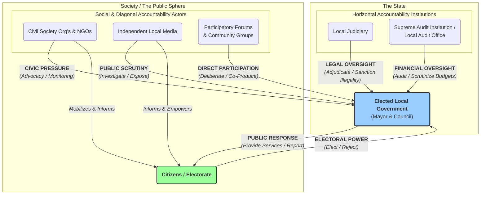

```mermaid
graph TD
    subgraph "The State"
        LG("<b>Elected Local Government</b><br>(Mayor & Council)")
        subgraph "Horizontal Accountability Institutions"
            direction LR
            HJ(Local Judiciary)
            AO(Supreme Audit Institution /<br>Local Audit Office)
        end
    end

    subgraph "Society / The Public Sphere"
        C("<b>Citizens / Electorate</b>")
        subgraph "Social & Diagonal Accountability Actors"
            direction LR
            CSO(Civil Society Org's & NGOs)
            M(Independent Local Media)
            F(Participatory Forums<br>& Community Groups)
        end
    end

    %% Main Accountability Relationships
    C -- "<b>ELECTORAL POWER</b><br><i>(Elect / Reject)</i>" --> LG
    LG -- "<b>PUBLIC RESPONSE</b><br><i>(Provide Services / Report)</i>" --> C

    HJ -- "<b>LEGAL OVERSIGHT</b><br><i>(Adjudicate / Sanction Illegality)</i>" --> LG
    AO -- "<b>FINANCIAL OVERSIGHT</b><br><i>(Audit / Scrutinize Budgets)</i>" --> LG

    CSO -- "<b>CIVIC PRESSURE</b><br><i>(Advocacy / Monitoring)</i>" --> LG
    M -- "<b>PUBLIC SCRUTINY</b><br><i>(Investigate / Expose)</i>" --> LG
    F -- "<b>DIRECT PARTICIPATION</b><br><i>(Deliberate / Co-Produce)</i>" --> LG

    %% Interplay & Synergy (The most critical addition)
    M -- "<i>Informs & Empowers</i>" --> C
    CSO -- "<i>Mobilizes & Informs</i>" --> C
    
    style LG fill:#9cf,stroke:#333,stroke-width:3px
    style C fill:#9f9,stroke:#333,stroke-width:2px
```
